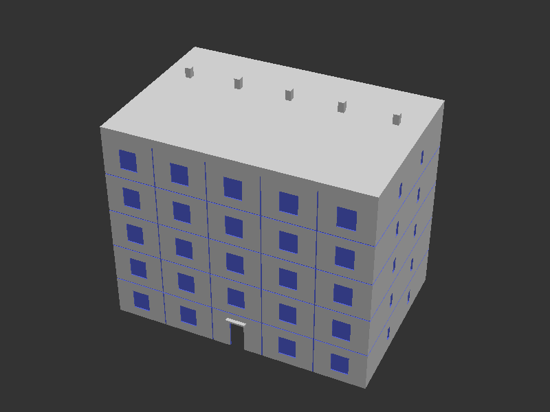
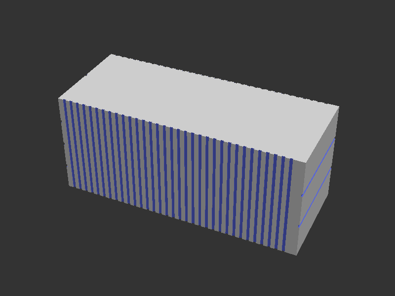
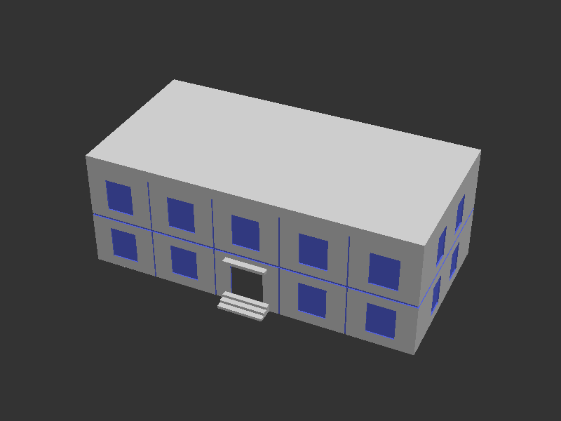
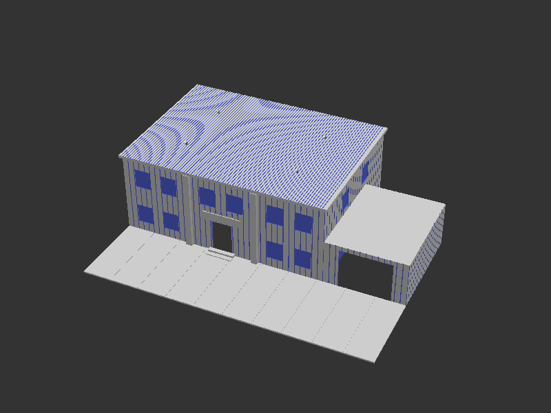
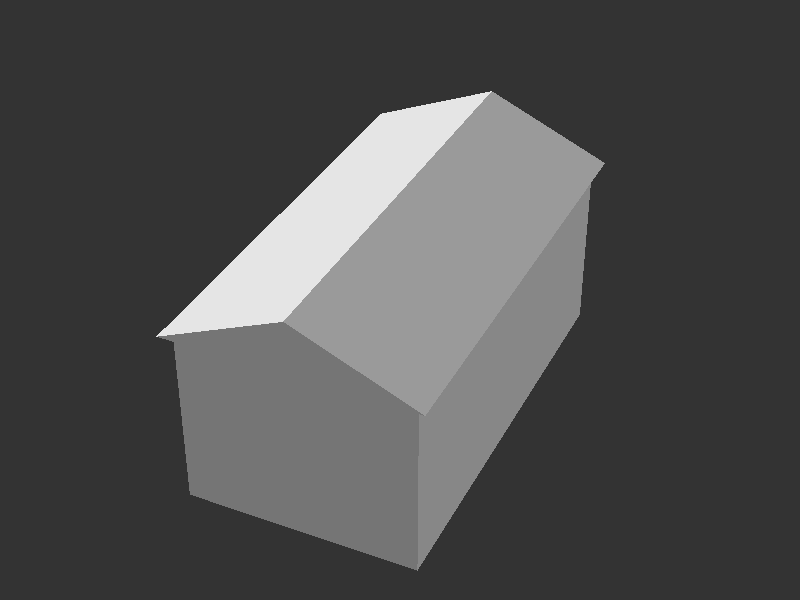
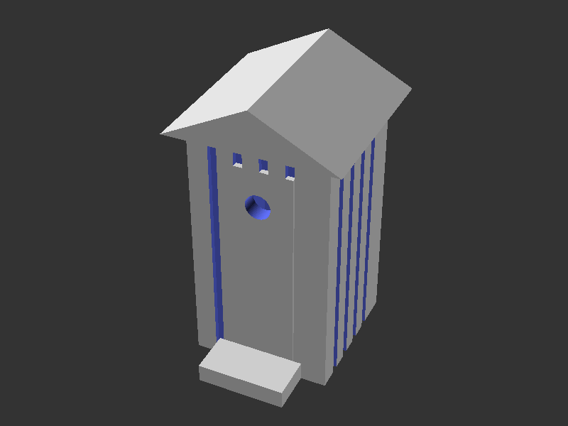

# H0 Piko-like Diorama — OpenSCAD Models

3D printable models for an **H0 scale (1:87)** diorama. All objects are designed for visual realism on a layout — exteriors only, no interior detail. Sources are self-contained OpenSCAD files; outputs are STL files ready to slice.

Click any preview to open GitHub's interactive 3D viewer.

---

## Models

### Eastern European Apartment Block

Prefabricated concrete panel apartment block ("blok"), typical of Eastern European post-war housing estates. Parametric: number of floors, building width, and depth are configurable at the top of the source file.

Features: flat roof with parapet, regular window grid on all facades, narrow stairwell windows on gable ends, horizontal and vertical concrete panel joint grooves, recessed ground-floor entrance with canopy.

| Parameter | Default | Note |
|-----------|---------|------|
| `floors` | 5 | number of floors |
| `bld_w_real` | 18000 mm | real-world building width |
| `bld_d_real` | 12000 mm | real-world building depth |

| | File |
|-|------|
| OpenSCAD source | [ee_apartment_block.scad](ee_apartment_block.scad) |
| STL | [ee_apartment_block.stl](ee_apartment_block.stl) |

---

### Marine Container

ISO dry-cargo shipping container. Set `container_m = 6` for a 20 ft unit or `container_m = 12` for a 40 ft unit — width and height are identical for both per the ISO standard.

Features: vertical corrugation grooves on both long side walls (0.8 mm pitch, 34 grooves on the 20 ft version), three horizontal panel rail grooves on the door end with a vertical centre groove between the two door leaves, two horizontal grooves on the sealed nose end.

| | 20 ft (6 m) | 40 ft (12 m) |
|--|------------|--------------|
| Length | 69.6 mm | 140.1 mm |
| Width | 28.0 mm | 28.0 mm |
| Height | 29.8 mm | 29.8 mm |

| | File |
|-|------|
| OpenSCAD source | [marine_container.scad](marine_container.scad) |
| STL | [marine_container.stl](marine_container.stl) |

---

### Police Station

PRL-era two-storey police station (*posterunek milicji*). Austere socialist functionalist style: flat roof with parapet, five-bay window grid on front and back, two windows per floor on the side walls, pronounced horizontal cornice groove between the floors, and vertical concrete panel joint grooves. Ground-floor centre entrance with three concrete steps and a canopy.

| Dimension | Real | H0 |
|-----------|------|----|
| Footprint | 18 m × 9 m | 206.9 × 103.4 mm |
| Total height (with parapet) | 6.6 m | 75.9 mm |

| | File |
|-|------|
| OpenSCAD source | [police_station.scad](police_station.scad) |
| STL | [police_station.stl](police_station.stl) |

---

### Police Station (Cities Skylines style)

Interpretation of the BTB Small Police Station Cities: Skylines asset. Two-storey main block with dark vertical metal panel siding, three-bay front facade with two prominent full-height pilasters at bay boundaries. Two large windows per bay per floor; centre bay has the entrance on the ground floor and windows on the first. Corrugated flat metal roof with 2.5 mm overhang and four HVAC dome vents. Raised sign panel above the entrance door with two concrete steps. Single-storey annex attached to the right with a large vehicle bay opening. Concrete parking lot in front of the full building width with marked parking space dividers (7 m deep, 2.5 m space width).

| Dimension | Real | H0 |
|-----------|------|----|
| Main block | 18 m × 13 m | 206.9 × 149.4 mm |
| Main height | 7.0 m + roof | 80.5 + 3 mm |
| Annex | 7 m × 9 m × 4 m | 80.5 × 103.4 × 46.0 mm |

| | File |
|-|------|
| OpenSCAD source | [police_station_cs.scad](police_station_cs.scad) |
| STL | [police_station_cs.stl](police_station_cs.stl) |

---

### Single Car Garage

Standalone single car garage with a gabled roof, four-section sectional door on the front facade, and a small window on the left side wall.

| Dimension | Real | H0 |
|-----------|------|----|
| Footprint | 3 m × 5.5 m | 34.5 × 63.2 mm |
| Eave height | 2.4 m | 27.6 mm |

| | File |
|-|------|
| OpenSCAD source | [single_car_garage.scad](single_car_garage.scad) |
| STL | [single_car_garage.stl](single_car_garage.stl) |

---

### Sławojka (Polish Outdoor Toilet)

Traditional Polish outhouse, mandated across rural Poland in the 1930s by minister Składkowski — hence the name. A small wooden plank box with a gabled roof, sized for one person.

Features: vertical plank texture on all four walls, door panel with a traditional circular moon cutout, through-wall ventilation slot on the back wall near the top, small concrete entrance step.

| Dimension | Real | H0 |
|-----------|------|----|
| Footprint | 1.1 m × 1.1 m | 12.6 × 12.6 mm |
| Wall height | 2.0 m | 23.0 mm |

| | File |
|-|------|
| OpenSCAD source | [slawojka.scad](slawojka.scad) |
| STL | [slawojka.stl](slawojka.stl) |

---

## Printing notes

- All models print flat on the build plate with no required supports
- Recommended nozzle: 0.4 mm; minimum layer height: 0.1 mm
- Scale: 1:87 — do **not** resize in the slicer
